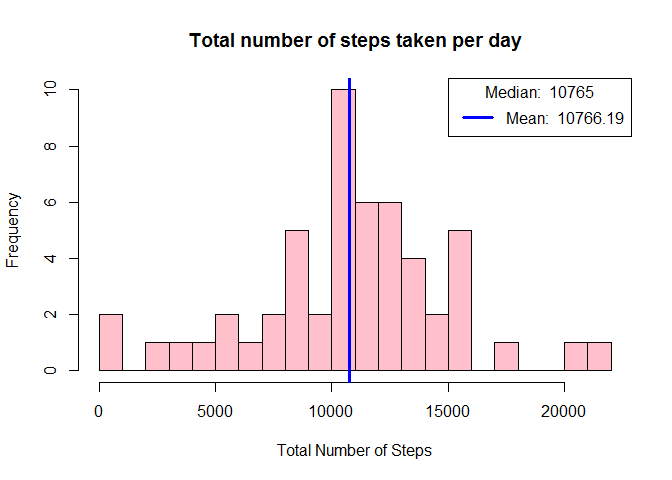
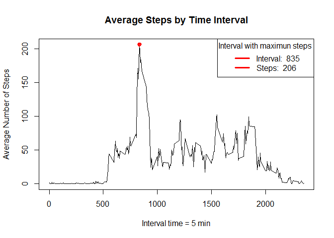
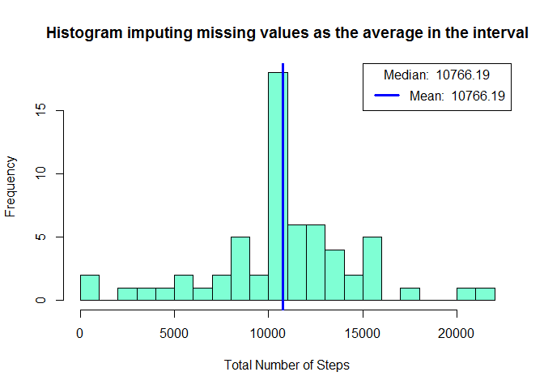
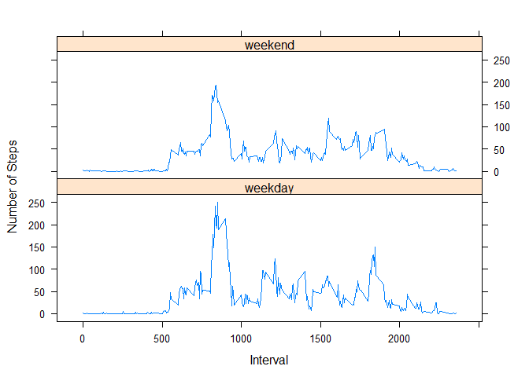

# Reproducible Research : Peer Assesment 1
Carolina A Tarraga  
`r Sys.Date()`  


# Introduction

It is now possible to collect a large amount of data about personal movement using activity monitoring devices such as a Fitbit, Nike Fuelband, or Jawbone Up. These type of devices are part of the "quantified self" movement - a group of enthusiasts who take measurements about themselves regularly to improve their health, to find patterns in their behavior, or because they are tech geeks. But these data remain under-utilized both because the raw data are hard to obtain and there is a lack of statistical methods and software for processing and interpreting the data.

This assignment makes use of data from a personal activity monitoring device. This device collects data at 5 minute intervals through out the day. The data consists of two months of data from an anonymous individual collected during the months of October and November, 2012 and include the number of steps taken in 5 minute intervals each day.

The data for this assignment can be downloaded from the course web site:

- *Dataset* : Activity monitoring data [52K]

The variables included in this dataset are:

1) *steps* : Number of steps taking in a 5-minute interval (missing values are coded as NA)
2) *date* : The date on which the measurement was taken in YYYY-MM-DD format
3) *interval* : Identifier for the 5-minute interval in which measurement was taken

The dataset is stored in a comma-separated-value (CSV) file and there are a total of 17,568 observations in this dataset.


## Loading the data


```r
activity <- read.csv('activity.csv')
```

### Lets have a look 

```r
head(activity)
```

```
##   steps       date interval
## 1    NA 2012-10-01        0
## 2    NA 2012-10-01        5
## 3    NA 2012-10-01       10
## 4    NA 2012-10-01       15
## 5    NA 2012-10-01       20
## 6    NA 2012-10-01       25
```

```r
str(activity)
```

```
## 'data.frame':	17568 obs. of  3 variables:
##  $ steps   : int  NA NA NA NA NA NA NA NA NA NA ...
##  $ date    : Factor w/ 61 levels "2012-10-01","2012-10-02",..: 1 1 1 1 1 1 1 1 1 1 ...
##  $ interval: int  0 5 10 15 20 25 30 35 40 45 ...
```

## What is mean total number of steps taken per day?
Make a histogram of the total number of steps taken each day
Calculate and report the mean and median total number of steps taken per day


```r
#agregate the data by steps
totalstepsbydate <- aggregate(steps ~ date, data = activity , FUN = "sum", na.rm = TRUE)

#Draw histogram
hist(totalstepsbydate$steps, breaks = 25, 
     main = "Total number of steps taken per day", 
     xlab = "Total Number of Steps", col = "pink")

#Draw mean, we cant draw a separate median because they are directly on top of each other
abline(v = mean(totalstepsbydate$steps), lwd = 3, col = "blue")

#Give median and mean as legend
legend("topright", lty = 1, lwd = 3, col = c("blue", "black"), 
       legend = paste("Mean: ", round(mean(totalstepsbydate$steps),2)), 
       title = paste("Median: ", round(median(totalstepsbydate$steps),2)))
```

<!-- -->

```r
mean(totalstepsbydate$steps)
```

```
## [1] 10766.19
```

```r
median(totalstepsbydate$steps)
```

```
## [1] 10765
```

## What is the average daily activity pattern?
Make a time series plot (i.e. type = "l") of the 5-minute interval (x-axis)
and the average number of steps taken, averaged across all days (y-axis)
Which 5-minute interval, on average across all the days in the dataset,
contains the maximum number of steps?


```r
#agregate the data by intervals
stepsbyinterval <- aggregate(steps ~ interval, data = activity, FUN = "mean", na.rm = TRUE)

#Plot the data
plot(stepsbyinterval$interval,stepsbyinterval$steps,type = "l", main = "Average Steps by Time Interval",
             xlab = "Interval time = 5 min", ylab = "Average Number of Steps")

#Find the interval with the most steps, find how many steps in that interval
intervalmaxsteps <- stepsbyinterval$interval[which.max(stepsbyinterval$steps)]
maxsteps <- stepsbyinterval$steps[stepsbyinterval$interval == intervalmaxsteps]

#Draw the point with the max steps in red
points(intervalmaxsteps,  maxsteps, col = "red", lwd = 2, pch = 10)

#Give the data about the interval and the max steps as a legend
legend("topright", lty = 1, lwd = 3, col = "red", 
       legend = c(paste("Interval: ", intervalmaxsteps), paste("Steps: ", round(maxsteps, 0))), 
       title = "Interval with maximun steps")
```

<!-- -->

```r
stepsbyinterval$interval[which.max(stepsbyinterval$steps)]
```

```
## [1] 835
```

```r
stepsbyinterval$steps[stepsbyinterval$interval == intervalmaxsteps]
```

```
## [1] 206.1698
```

## Imputing missing values
Note that there are a number of days/intervals where there are missing values
(coded as NA). The presence of missing days may introduce bias into some
calculations or summaries of the data.
1. Calculate and report the total number of missing values in the dataset
(i.e. the total number of rows with NAs)


```r
#Calculate and report the total number of missing values in the dataset (rows with NAs)

#Total rows with NA: 
sum(is.na(activity$steps))
```

```
## [1] 2304
```

```r
#Percentage %
sum(is.na(activity$steps))/nrow(activity)*100
```

```
## [1] 13.11475
```

2. Devise a strategy for filling in all of the missing values in the dataset. The
strategy does not need to be sophisticated. For example, you could use
the mean/median for that day, or the mean for that 5-minute interval, etc.

```r
#We will use the 5-minute interval average steps calculated in step 2 to replace all NA in the original dataset.
mergeddata <- merge(activity,stepsbyinterval, by = "interval")
mergeddata$steps.x[is.na(mergeddata$steps.x)] <- mergeddata$steps.y[is.na(mergeddata$steps.x)]
```

3. Create a new dataset that is equal to the original dataset but with the
missing data filled in.

```r
newdata <- mergeddata[c("interval","steps.x","date")]
colnames(newdata) <- c("interval","steps","date")
library(plyr)
newdata <- arrange(newdata,date,interval)
#Let's checkout the new data
head(newdata)
```

```
##   interval     steps       date
## 1        0 1.7169811 2012-10-01
## 2        5 0.3396226 2012-10-01
## 3       10 0.1320755 2012-10-01
## 4       15 0.1509434 2012-10-01
## 5       20 0.0754717 2012-10-01
## 6       25 2.0943396 2012-10-01
```

```r
str(newdata)
```

```
## 'data.frame':	17568 obs. of  3 variables:
##  $ interval: int  0 5 10 15 20 25 30 35 40 45 ...
##  $ steps   : num  1.717 0.3396 0.1321 0.1509 0.0755 ...
##  $ date    : Factor w/ 61 levels "2012-10-01","2012-10-02",..: 1 1 1 1 1 1 1 1 1 1 ...
```

4. Make a histogram of the total number of steps taken each day and Calculate
and report the mean and median total number of steps taken per day. Do
these values differ from the estimates from the first part of the assignment?
What is the impact of imputing missing data on the estimates of the total
daily number of steps?


```r
#agregate the data by steps
newtotalstepsbydate <- aggregate(steps ~ date, data = newdata , FUN = "sum", na.rm = TRUE)

#Draw histogram
hist(newtotalstepsbydate$steps, breaks = 25, 
     main = "Histogram imputing missing values as the average in the interval", 
     xlab = "Total Number of Steps", col = "aquamarine")

#Draw mean, we cant draw a separate median because they are directly on top of each other
abline(v = mean(newtotalstepsbydate$steps), lwd = 3, col = "blue")

#Give median and mean as legend
legend("topright", lty = 1, lwd = 3, col = c("blue", "black"), 
       legend = paste("Mean: ", round(mean(newtotalstepsbydate$steps),2)), 
       title = paste("Median: ", round(median(newtotalstepsbydate$steps),2)))
```

<!-- -->

```r
mean(newtotalstepsbydate$steps)
```

```
## [1] 10766.19
```

```r
median(newtotalstepsbydate$steps)
```

```
## [1] 10766.19
```


## Are there differences in activity patterns between weekdays and weekends?
For this part the weekdays() function may be of some help here. Use the dataset
with the filled-in missing values for this part.
1. Create a new factor variable in the dataset with two levels - "weekday"
and "weekend" indicating whether a given date is a weekday or weekend
day.
2. Make a panel plot containing a time series plot (i.e. type = "l") of the
5-minute interval (x-axis) and the average number of steps taken, averaged
across all weekday days or weekend days (y-axis).

```r
#Let's discrimminate between weekdays and weekend
daytype <- lapply(as.Date(newdata$date), function(x) if (weekdays(x) < "Saturday") {return("weekday")} else {return("weekend")})
newdata$daytype <- unlist(daytype)

meanstepsbydatebydaytype <- aggregate(steps ~ interval + daytype, data = newdata , FUN = "mean", na.rm = TRUE)

#Let's plot as directed
library(lattice)
xyplot(steps ~ interval | daytype, data = meanstepsbydatebydaytype,
      type = 'l',
      xlab = 'Interval',
      ylab = 'Number of Steps',
      layout = c(1,2))
```

<!-- -->


