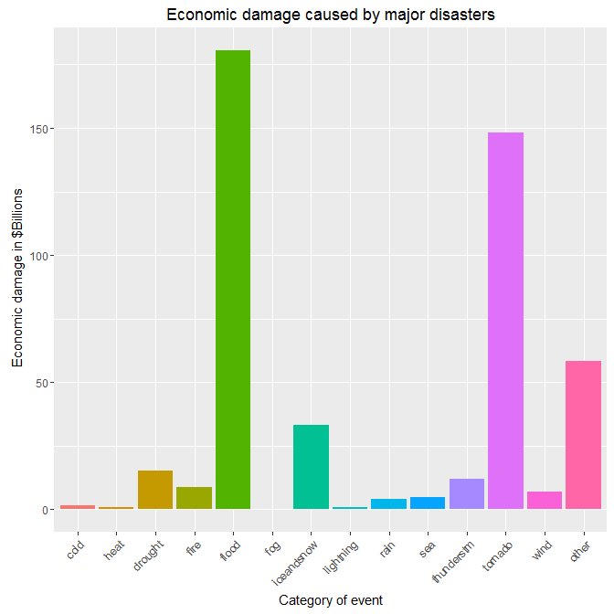

# Public health and economic problems derived from storms and other severe weather events in the USA; Tornadoes most lethal, floods most economically damaging
Carolina A Tarraga  
`r Sys.Date()`  


# Synopsis
* Storms and other severe weather events can cause both public health and economic
problems for communities and municipalities. Many severe events can result in
fatalities, injuries, and property damage, and preventing such outcomes to the extent
possible is a key concern.
* This project involves exploring the U.S. National Oceanic and Atmospheric
Administration's [(NOAA)](http://www.ncdc.noaa.gov/) storm
[database](http://www.ncdc.noaa.gov/stormevents/ftp.jsp). This database tracks 
characteristics of major storms and weather events in the United States, including 
when and where they occur, as well as estimates of any fatalities, injuries, and property damage.
    + The events in the database start in the year 1950 and end in November 2011. 
    In the earlier years of the database there are generally fewer events recorded, most 
    likely due to a lack of good records. More recent years should be considered more complete.

# Data procesing

## Data source
* The [data](https://d396qusza40orc.cloudfront.net/repdata%2Fdata%2FStormData.csv.bz2) 
come in the form of a comma-separated-value file compressed via the bzip2 algorithm to 
reduce its size.
    + There is also some 
    documentation](https://d396qusza40orc.cloudfront.net/repdata%2Fpeer2_doc%2Fpd01016005curr.pdf) 
    of the data available.

***
## Data Loading

The events in the database start in the year 1950 and end in November 2011. 
In the earlier years of the database, there are fewer events recorded, 
most likely due to a lack of good records. More recent years should be 
considered more complete.


```r
download.file("https://d396qusza40orc.cloudfront.net/repdata%2Fdata%2FStormData.csv.bz2", 
              destfile = "repdata-data-StormData.csv.bz2", method = "auto",  mode = "wb")
data <- read.csv(bzfile("repdata-data-StormData.csv.bz2"), stringsAsFactors = FALSE)
```

## Selection of the columns we are going to work with 

We will select only columns we care about to speed up our processing time   

## Eliminate espaces and other special caracters from event types  

## Monetary fields

Monetary data is not completely numeric.
There are two columns in the data set to represent monetary damage: PROPDMG and CROPDMG. 
However, these are in units defined in the PROPDMGEXP and CROPDMGEXP columns, respectively. 
So we'll first need to define a new column that is for total damages by event in a consistent set of units

## Event type categorization

Let's have a look to see whatcan be done to consolidate or categorize the event types. 
Naming is very inconsistent and doesn't follow a pattern or naming convention. 
I am going to reduce the event categories by classifying 
the event types. Let's use "grep" of a few keywords in the event type names 
to try to scan the naming and have a better consolidated view of the data 
classification in the database. 
We will add a category column to the database with the results of the "grep". 
I don't expect this categorization to be perfect, but it should be a strong 
first approximation. In many cases, the event name denotes two or more 
natural events combined causing the damage and in those cases, we will cast 
to just one category.
Additionally, we should keep the "other" category under 10% for good results. 

***

*Let's try to accumulate all the impact specific events have in human life and economical.* 
*After looking at the naming in the database i can see up to 20 different ways a tornado could be called*


```r
# Selection of the columns we are going to work with
data <- data %>% subset(select = c( "EVTYPE", "FATALITIES", "INJURIES", "PROPDMG", "PROPDMGEXP", 
                                    "CROPDMG", "CROPDMGEXP")) %>%
# Eliminate espaces and other special caracters from event types  
                 mutate(EVTYPE = tolower(EVTYPE), 
                        EVTYPE = gsub("[[:blank:]]", "", EVTYPE, fixed = TRUE),
                        PERSONALHARM = FATALITIES + INJURIES,
                        PROPDMGEXP = tolower(PROPDMGEXP), 
                        CROPDMGEXP = tolower(CROPDMGEXP)) %>%
# Monetary fields transformation                
                 mutate(TOTALPROPDMG = ifelse(PROPDMGEXP == "k", PROPDMG*1000, 
                                              ifelse(PROPDMGEXP == "m", PROPDMG*1000000, 
                                                     ifelse(PROPDMGEXP == "b", PROPDMG*1000000000, 
                                                            ifelse(PROPDMGEXP == "h", PROPDMG*100, PROPDMG))))) %>%
                 mutate(TOTALCROPDMG = ifelse(CROPDMGEXP == "k", CROPDMG*1000, 
                                              ifelse(CROPDMGEXP == "m", CROPDMG*1000000, 
                                                     ifelse(CROPDMGEXP == "b", CROPDMG*1000000000, 
                                                            ifelse(CROPDMGEXP == "h", CROPDMG*100, CROPDMG))))) %>%
                 mutate(TOTALDMG = TOTALCROPDMG + TOTALPROPDMG) %>%
# Event type categorization  
                 mutate( EVCAT = derivedFactor( 
                        "cold" = grepl("chill|cold|cool|hypothermia|lowtemp|sleet", EVTYPE),
                        "heat" = grepl("heat|hightemp|hot|warm|hyperth", EVTYPE), 
                        "drought" = grepl("belownormalprecip|dry|drie|drought", EVTYPE),
                        "fire" = grepl("fire|smoke", EVTYPE),
                        "flood" = grepl("current|dam|drown|flood|floood|fld|erosi|landslump|
                                        water|river|slide|lake", EVTYPE),
                        "fog" = grepl("fog|vog", EVTYPE),
                        "iceandsnow" = grepl("avalanc|blizzard|glaze|hail|ice|icy|freez|frost|
                                             wint|snow", EVTYPE), 
                        "lightning" = grepl("light|lignt", EVTYPE),
                        "rain" = grepl("depres|drizzle|shower|precip|rain|ripcurrent|stream|
                                       storm|seiche|swell|torrent|wet", EVTYPE),
                        "sea" = grepl("beach|coast|cstl|highwaves|marine|roguewave|sea|surf|tide|
                                      tidal|tsuna", EVTYPE),
                        "thunderstm" = grepl("tstm|thunder", EVTYPE),
                        "tornado" = grepl("burst|cloud|floyd|funnel|gust|hurricane|spout|torn|
                                          turbul|typhoon|wall", EVTYPE),  
                        "quake" = grepl("quake", EVTYPE),
                        "wind" = grepl("wind|wnd", EVTYPE), .method = "first", .default = "other"))
```

#Results

There are 2 questions we need to answer

## Across the United States, which types of events (as indicated in the EVTYPE variable) are most harmful with respect to population health?

Here we can see the major 14 event categories that aggregate events by similarity and the personal injury and fatalities that they create. 
The first table explains the injuries, the second table explains the fatalities and the last one is 
the aggregate.


```r
arrange(aggregate(INJURIES ~ EVCAT, data = data, sum), desc(INJURIES))
```

```
##         EVCAT INJURIES
## 1     tornado    92782
## 2  thunderstm     9413
## 3       flood     9274
## 4        heat     9243
## 5  iceandsnow     6048
## 6   lightning     5232
## 7       other     2864
## 8        wind     1843
## 9        fire     1608
## 10        fog     1076
## 11        sea      479
## 12       cold      325
## 13       rain      308
## 14    drought       33
```

```r
arrange(aggregate(FATALITIES ~ EVCAT, data = data, sum), desc(FATALITIES))
```

```
##         EVCAT FATALITIES
## 1     tornado       5779
## 2        heat       3179
## 3       flood       2175
## 4   lightning        817
## 5  thunderstm        706
## 6  iceandsnow        646
## 7        cold        478
## 8        wind        421
## 9       other        393
## 10        sea        274
## 11       rain        104
## 12       fire         90
## 13        fog         80
## 14    drought          3
```

```r
arrange(aggregate(PERSONALHARM ~ EVCAT, data = data , sum),desc(PERSONALHARM))
```

```
##         EVCAT PERSONALHARM
## 1     tornado        98561
## 2        heat        12422
## 3       flood        11449
## 4  thunderstm        10119
## 5  iceandsnow         6694
## 6   lightning         6049
## 7       other         3257
## 8        wind         2264
## 9        fire         1698
## 10        fog         1156
## 11       cold          803
## 12        sea          753
## 13       rain          412
## 14    drought           36
```

Let's plot to appreciate the data, we can see that tornadoes are by far the most mortal events in the USA


```r
opts_chunk$set(fig.keep = "yes", fig.path = 'fig/')

g <- ggplot(data, aes(x = EVCAT,  y = PERSONALHARM, fill = EVCAT))
g <- g + geom_bar(stat = "identity") +
  xlab("Category of event") + 
  ylab(expression(" Fatalities and Injuries" )) +
  scale_fill_discrete(name = "Type of event") +
  theme(legend.position = "Type of event", axis.text.x = element_text(angle = 45, hjust = 1)) +
  ggtitle("Personal damage caused by major disasters")
g
```

<!-- -->

## Across the United States, which types of events have the greatest economic consequences?

Here we can see the major 14 event categories and the and the property and crop damage they create.
The first table explains the property damage caused by the events and the second one explains 
the crop damage caused. The third table is the aggregated of the previous ones


```r
arrange(aggregate(TOTALPROPDMG ~ EVCAT, data = data , sum),desc(TOTALPROPDMG)) 
```

```
##         EVCAT TOTALPROPDMG
## 1       flood 167967508682
## 2     tornado 142361474839
## 3       other  57762952481
## 4  iceandsnow  23249333128
## 5  thunderstm  10924632732
## 6        fire   8501728500
## 7        wind   6127195783
## 8         sea   4905208390
## 9        rain   3237040190
## 10    drought   1052838600
## 11  lightning    934017947
## 12       cold    249384450
## 13        fog     25011500
## 14       heat     20325750
```

```r
arrange(aggregate(TOTALCROPDMG ~ EVCAT, data = data , sum),desc(TOTALCROPDMG)) 
```

```
##         EVCAT TOTALCROPDMG
## 1     drought  13972581000
## 2       flood  12704899200
## 3  iceandsnow  10083881273
## 4     tornado   5931290820
## 5        cold   1438765550
## 6  thunderstm   1206798738
## 7        rain    948162800
## 8        heat    904479280
## 9        wind    755555400
## 10      other    741479400
## 11       fire    403281630
## 12  lightning     12097090
## 13        sea       920000
## 14        fog            0
```

```r
arrange(aggregate(TOTALDMG ~ EVCAT, data = data , sum),desc(TOTALDMG)) 
```

```
##         EVCAT     TOTALDMG
## 1       flood 180672407882
## 2     tornado 148292765659
## 3       other  58504431881
## 4  iceandsnow  33333214401
## 5     drought  15025419600
## 6  thunderstm  12131431470
## 7        fire   8905010130
## 8        wind   6882751183
## 9         sea   4906128390
## 10       rain   4185202990
## 11       cold   1688150000
## 12  lightning    946115037
## 13       heat    924805030
## 14        fog     25011500
```

```r
#Easier in the eyes in Billion dollars
data$TOTALPROPDMG <- data$TOTALPROPDMG /(10 ^ 9)
data$TOTALCROPDMG <- data$TOTALCROPDMG /(10 ^ 9)
data$TOTALDMG <- data$TOTALDMG /(10 ^ 9)
```

Let's plot to appreciate the data, here we can see that flood related events are more devastating followed closely by tornadoes.


```r
opts_chunk$set(fig.keep = "yes", fig.path = 'fig/')

g <- ggplot(data, aes(x = EVCAT,  y = TOTALDMG, fill = EVCAT))
g <- g + geom_bar(stat = "identity") + 
  xlab("Category of event") + 
  ylab(expression(" Economic damage in $Billions" )) +
  scale_fill_discrete(name = "Type of event") +
  theme(legend.position = "none", axis.text.x = element_text(angle = 45, hjust = 1)) +
  ggtitle("Economic damage caused by major disasters")
g
```

<!-- -->
