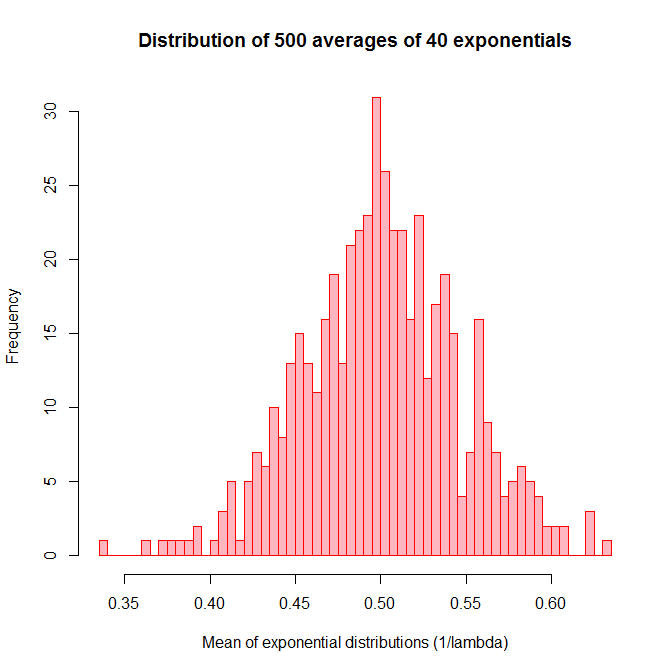
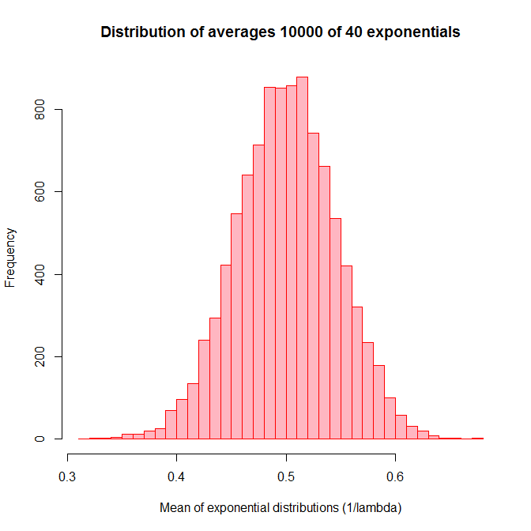
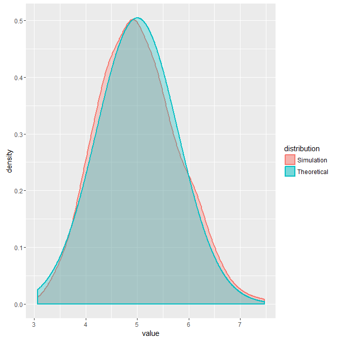
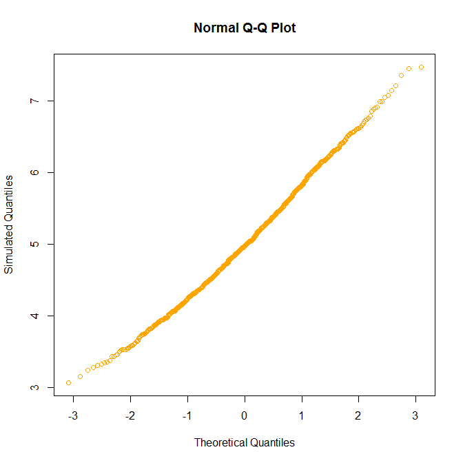

# Statistical Interference Course Project 1
Carolina A Tarraga  
`r Sys.Date()`  


#Overview 

This Project involves an investigation into applied sampling statistics using the exponential distribution as a backdrop. At the core of this exercise is the fact that according to the central limit theorem (CLT), the distribution of sample means follow normal distribution. 

A random exponential distribution will be sampled over many simulations with the sample mean and variance compared to theoretical levels and the normality of the sample distribution shown.

#Method 

We are going to go over an investigation via simulation and associated explanatory text the properties of the distribution of the mean of 40 exponentials. We will:

    1) Show the sample mean and compare it to the theoretical mean of the distribution.  
    2) Show how variable the sample is (via variance) and compare it to the theoretical variance of the distribution.    
    3) Show that the distribution is approximately normal focussing on the difference between the distribution of a large collection of random exponentials and the distribution of a large collection of averages of 40 exponentials.

The output must include:

- Title (give an appropriate title) and Author Name  

- Overview: In a few (2-3) sentences explain what is going to be reported on.

- Simulations: Include English explanations of the simulations you ran, with the accompanying R code. Your explanations should make clear what the R code accomplishes.

- Sample Mean versus Theoretical Mean: Include figures with titles. In the figures, highlight the means you are comparing. Include text that explains the figures and what is shown on them, and provides appropriate numbers.

- Sample Variance versus Theoretical Variance: Include figures (output from R) with titles. Highlight the variances you are comparing. Include text that explains your understanding of the differences of the variances.

- Distribution: Via figures and text, explain how one can tell the distribution is approximately normal

#Central Limit Theorem 

Looking to understand how a simulated sample mean and variance compared to theoretical levels in a random exponential distribution sampled over many simulations, we should review in deep some of the most important theorems that apply to this exercise.

> The central limit theorem (CLT) states that, given certain conditions, the arithmetic mean of a sufficiently large number of iterates of independent random variables, each with a well-defined expected value and well-defined variance, will be approximately normally distributed, regardless of the underlying distribution. 
To illustrate what this means, suppose that a sample is obtained containing a large number of observations, each observation being randomly generated in a way that does not depend on the values of the other observations, and that the arithmetic average of the observed values is computed. If this procedure is performed many times, the central limit theorem says that the computed values of the average will be distributed according to the normal distribution. 
## Distribution of averages of 40 exponentials (500, 10000) 

The exponential distribution can be simulated in R with rexp(n, $\lambda$) where $\lambda$ is the rate parameter. 
The mean of exponential distribution is 1/$\lambda$ and the standard deviation is also 1/$\lambda$. 
Set $\lambda$ = 0.2 for all of the simulations.

As we can see, the distribution of 1000 random uniforms will remain uniform as our sample grows. With a big enough sample we will see that the bars in the histogram will tend to have a Gaussian shape with a well centered mean. 

### **500 averages**


```r
mns = NULL
for (i in 1:500) mns = c(mns, mean(runif(40)))
hist(mns,breaks = 50, col = "lightpink", border = "red", main = "Distribution of 500 averages of 40 exponentials", xlab = "Mean of exponential distributions (1/lambda)" )
```

<!-- -->

### **10000 averages**


```r
mns = NULL
for (i in 1:10000) mns = c(mns, mean(runif(40)))
hist(mns,breaks = 50, col = "lightpink", border = "red", main = "Distribution of averages 10000 of 40 exponentials", xlab = "Mean of exponential distributions (1/lambda)" )
```

<!-- -->

***
#Sample vs. theoretical mean, standard distribution, and variance

Let’s examine the main data in the two models. First, we will create the data sets and then we will have a look.

##Data preparation

```r
set.seed(13137); lambda <- 0.2; sim <- 1000; n <- 40

#Simulated data
simexp <- replicate(sim, rexp(n,lambda))
meanexp <- colMeans(simexp)
sstdev <- sd(meanexp)

svar <- sstdev^2
smean <- mean(meanexp)

#Theoretical data
tstdev <- (1/lambda)/sqrt(n)
tvar <- tstdev^2
tmean <- 1/lambda

#coefficients matrix
data <- matrix(c(smean, sstdev, svar, tmean, tstdev, tvar), ncol = 3, byrow = TRUE)
colnames(data) <- c( "  Mean  ", "  Standard Variation", "  Variance  ")
rownames(data) <- c( "Simulated Data: ", "Theorical Data: ")
data <- as.table( data)
```

After all the calculations are needed let's explore the data:

```r
# Lets have a look at the data
data
```

```
##                     Mean     Standard Variation   Variance  
## Simulated Data:  5.0346403            0.7859494    0.6177164
## Theorical Data:  5.0000000            0.7905694    0.6250000
```

As we can see the mean, the standard variation and the variancce values are very similar between the simulation and the theorical. This investigation has been done with 1000 simulations. If we want to use the TLL to our advantage we could use a number evne larger

## Distribution overlap

Let's plot the data and visually appreciate the similarity. Both the simulation and theoretical data are plotted using the ggplot2 package. 


```r
#creating the simulated distribution data
mns = NULL
for (i in 1:sim) {
  mns = c(mns,mean(rexp(n,lambda)))
}
simdata = data.frame(value = mns,distribution = "Simulation")
#creating the theorical distribution
xrange = seq(min(mns), max(mns), length = sim)
yfit = dnorm(xrange, mean = tmean, sd = (1/lambda/sqrt(n)))
theodata = data.frame(xrange,yfit,theoretical = "Theoretical")

gp = ggplot(data = simdata, aes_string(x = "value"))
gp = gp + geom_density(aes_string(fill = "distribution", colour = "distribution"),alpha = 0.3,size = 1)
gp = gp + geom_area(data = theodata,aes(x = xrange,y = yfit,fill = "Theoretical",colour = "Theoretical"),alpha = 0.3,size = 1)
gp
```

<!-- -->

After looking at the plot, and although both curves are very similar, we can see that the theoretical data curve is very smooth and centered, the simulated shift in some parts from it. According to the CLT we should be able to see more smoothness in the simulated data as we grow the number of simulations.

##Normality of the distributions

A way of demonstrating normality is using the quantiles of the distribution. A Q-Q plot (“Q” stands for quantile) is a probability plot, which is a graphical method for comparing two probability distributions by plotting their quantiles against each other. 


```r
n = length(mns)
prob = (1:n)/(n + 1)
quant = qnorm(prob,mean(mns),sd(mns))
quantZ = NULL
for (i in 1:sim) {quantZ = c(quantZ,(quant[i] - mean(mns))/sd(mns))}
plot(sort(quantZ),sort(mns),main = "Normal Q-Q Plot",xlab = "Theoretical Quantiles",ylab = "Simulated Quantiles",col = "orange")
```

<!-- -->

As we can see all dots fall in the diagonal demostrating the CLT
