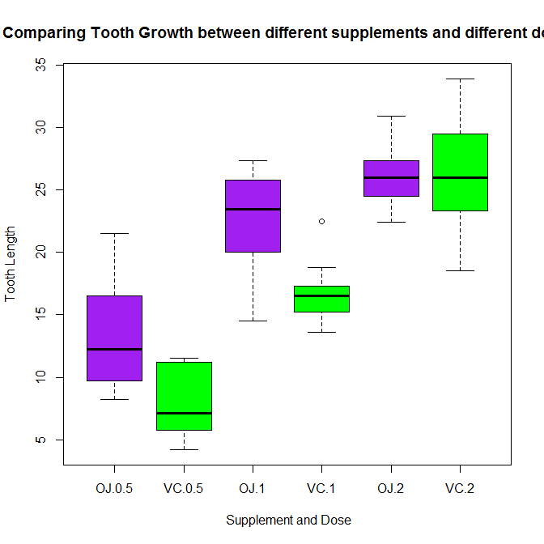
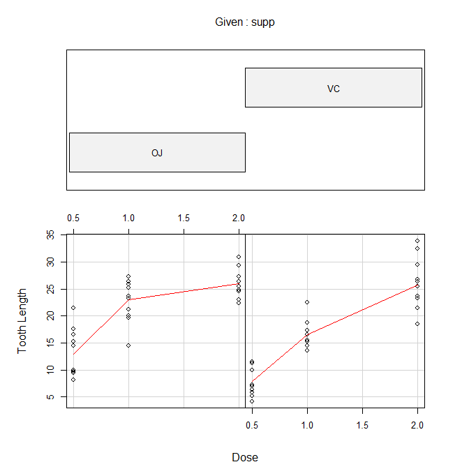

# Statistical Interference Course Project 2
Carolina A Tarraga  
`r Sys.Date()`  


#Overview

We need to load and perform basic exploratory analysis in the toothgrowt package. We do have limited knowledge of this package so we will go step by step until we get familiar with it. 
We will provide a basic summary of the data. We will use confidence intervals and/or hypothesis tests to compare tooth growth by supplement and dose. We will also state our conclusions and the assumptions needed for our conclusions.

#Exploratory Data Analysis

We first begin with calling the ToothGrowth dataset and assigning it to the variable data.TG. A summary of the dataset can be quickly computed


```r
data(ToothGrowth)
dataTG = ToothGrowth
```

##Number of rows

```r
nrow(dataTG)
```

```
## [1] 60
```

##Data distribution

```r
table(dataTG$supp,dataTG$dose)
```

```
##     
##      0.5  1  2
##   OJ  10 10 10
##   VC  10 10 10
```

##First rows of the table

```r
head(dataTG)
```

```
##    len supp dose
## 1  4.2   VC  0.5
## 2 11.5   VC  0.5
## 3  7.3   VC  0.5
## 4  5.8   VC  0.5
## 5  6.4   VC  0.5
## 6 10.0   VC  0.5
```

##Summary

```r
summary(dataTG)
```

```
##       len        supp         dose      
##  Min.   : 4.20   OJ:30   Min.   :0.500  
##  1st Qu.:13.07   VC:30   1st Qu.:0.500  
##  Median :19.25           Median :1.000  
##  Mean   :18.81           Mean   :1.167  
##  3rd Qu.:25.27           3rd Qu.:2.000  
##  Max.   :33.90           Max.   :2.000
```

```r
summary(lm(dataTG$len~dataTG$dose))
```

```
## 
## Call:
## lm(formula = dataTG$len ~ dataTG$dose)
## 
## Residuals:
##     Min      1Q  Median      3Q     Max 
## -8.4496 -2.7406 -0.7452  2.8344 10.1139 
## 
## Coefficients:
##             Estimate Std. Error t value Pr(>|t|)    
## (Intercept)   7.4225     1.2601    5.89 2.06e-07 ***
## dataTG$dose   9.7636     0.9525   10.25 1.23e-14 ***
## ---
## Signif. codes:  0 '***' 0.001 '**' 0.01 '*' 0.05 '.' 0.1 ' ' 1
## 
## Residual standard error: 4.601 on 58 degrees of freedom
## Multiple R-squared:  0.6443,	Adjusted R-squared:  0.6382 
## F-statistic: 105.1 on 1 and 58 DF,  p-value: 1.233e-14
```


We can see that there is a column len that we are to assume that is tooth length, supp is supplement, OJ is orange juice and VC is vitamin C.

There are 30 observations for OJ and 30 for VC. OJ or VC was given in different doses to individuals to understand the impact in their toothgowth. 

##Box Plot

Let's create some quick box plots to appreciate the data more in deep


```r
boxplot(len ~ supp * dose, data = dataTG, col = (c("purple", "green")), ylab = "Tooth Length", xlab = " Supplement and Dose", main = "Comparing Tooth Growth between different supplements and different dosis")
```

<!-- -->

```r
#legend('bottomright', c("OJ: Orange juice", "VC: Ascorbic acid"), fill = c("purple","green"),bty = "n")
```

We can appreciate a few points:

1) Looks like both supplements have a possitive impact in toothgrowth
2) At low doses, OJ seems more effective
3) at high doses OJ and VC seem to start equalizing

Let's have a look at the conditional plot


```r
# Conditional Plot
coplot(len ~ dose|supp, data = dataTG, panel = panel.smooth, col = par("fg"),
       xlab = "Dose", ylab = "Tooth Length", main = "Conditional plot len~dose") 
```

<!-- -->

##Confidence intervals and T tests

Let's have a look at the confidence intervals


```r
confint(lm(dataTG$len~dataTG$dose))
```

```
##                2.5 %    97.5 %
## (Intercept) 4.900171  9.944829
## dataTG$dose 7.856870 11.670273
```


```r
confint(lm(dataTG$len~dataTG$dose + dataTG$supp))
```

```
##                   2.5 %    97.5 %
## (Intercept)    6.704608 11.840392
## dataTG$dose    8.007741 11.519402
## dataTG$suppVC -5.889905 -1.510095
```

Let's check out T tests


```r
t.test(dataTG$len, dataTG$dose)
```

```
## 
## 	Welch Two Sample t-test
## 
## data:  dataTG$len and dataTG$dose
## t = 17.81, df = 59.798, p-value < 2.2e-16
## alternative hypothesis: true difference in means is not equal to 0
## 95 percent confidence interval:
##  15.66453 19.62881
## sample estimates:
## mean of x mean of y 
## 18.813333  1.166667
```

> P-Value < 0.05 
> confidence interval: 15.66453 19.62881

We can assume that the length of the tooth is impacted by the dose of the supplements


```r
t.test(len ~ supp, data = dataTG)
```

```
## 
## 	Welch Two Sample t-test
## 
## data:  len by supp
## t = 1.9153, df = 55.309, p-value = 0.06063
## alternative hypothesis: true difference in means is not equal to 0
## 95 percent confidence interval:
##  -0.1710156  7.5710156
## sample estimates:
## mean in group OJ mean in group VC 
##         20.66333         16.96333
```

> P-Value = 0.06 (P is greater than 0.05)  
> Confidence Interval: -0.17 to 7.57 (CI does cross 0)  

Given the P-Value is greater than 0.05 and the confidence interval does cross 0, we need to reject this hipotesis. 

#Conclusions and assumptions

There is an extremely close relationship between confidence intervals and hypothesis testing. When a 95% confidence interval is constructed, all values in the interval are considered plausible values for the parameter being estimated. Values outside the interval are rejected as relatively implausible. If the value of the parameter specified by the null hypothesis is contained in the 95% interval then the null hypothesis cannot be rejected at the 0.05 level. If the value specified by the null hypothesis is not in the interval then the null hypothesis can be rejected at the 0.05 level. If a 99% confidence interval is constructed, then values outside the interval are rejected at the 0.01 level.

Reviewing the t.test data, the following conclusions can be made:

    1) The increase in dosage of both supplements has positive impact tooth growth. P-Value < 0.05
    2) The type of supplement by itself does not affect tooth growth due to P-value > 0.05.
    3) Orange juice has stronger impact in tooth growth than vitamin C for low doses
    4) However, for high doses, the impact by Orange Juice and Vitamin C is similar.

For both OJ and Vitamin C, we rejected the null hypothesis (tooth growth is not effected by increasing levels of vitamin c and OJ) and accept the alternative hypothesis (tooth growth increases with increasing doses of vitamin C and OJ) based on the results of the t-test. In both cases, the t-test indicated that the sample mean of the higher concentration of dose (2.0 mg) fell outside the 95% confidence interval.

And the following assupmtions:

    1) There is unequal variance. 
    2) The sample is representative of the population.
    3) The distribution of the samples means follow CLT and is normal and represents the population mean 
    4) The above conclusions assume that the data are not paired.
    
    
